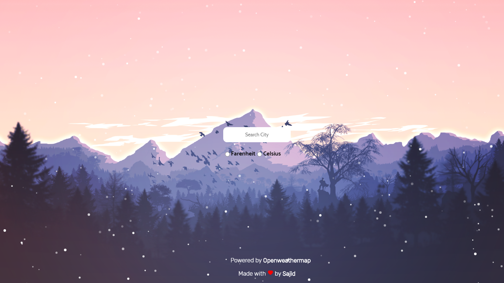

# Weather  

> Get current weather details

## Installations:

- Install dependecies with `npm install` 
- In project directory, run `npm start` 
    Open [http://localhost:3000](http://localhost:3000) to view it in the browser.

## Tech
- [React](https://reactjs.org/)

## Screenshots

[See more](screenshots/gif.gif)

## LICENSE
 ### Apache 2.0
